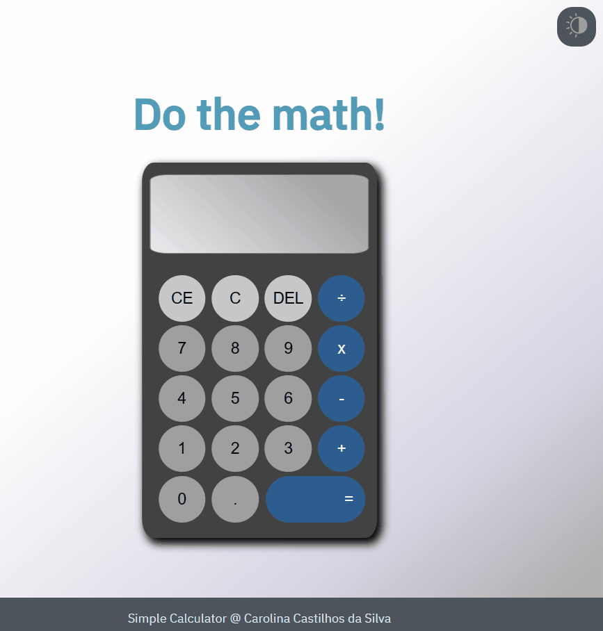

<h1 align="center"> Do the Math! </h1>

A simple calculator built with HTML, CSS and Javascript, with Dark and Ligth Mode.

Take a look:<a href="https://simplecalculatorcarol.netlify.app/" target="_blank"> Simple Calculator</a> 
  

<!-- 

 -->

## 💻 Technologies used

- IDE Visual Studio Code
- HTML
- CSS
- Javascript
